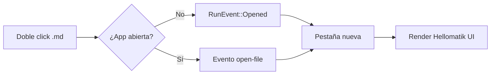

# Markdown Beauty

Un visor de Markdown para macOS construido con **Hellomatik UI**: tablas del sistema, bloques de código con shiki, callouts sobre Surface y tipografía editorial con *Hedvig Letters Serif* en los títulos.

> [!NOTE]
> Este documento de muestra ejercita todos los elementos del renderer. Ábrelo con `Cmd+P` para comprobar que también imprime precioso.

## Tipografía y texto

El cuerpo usa Inter a 16 px con interlineado 1.75 — cómodo para leer documentos largos. Los enlaces [se subrayan con el token de borde](https://hellomatik.com) y al pasar el ratón oscurecen. El texto puede ser **negrita**, *cursiva*, ***ambas***, ~~tachado~~ o `código inline` con su rosa característico.

### Listas

1. Las listas ordenadas usan numeración del sistema
2. Con espaciado vertical contenido
   1. Y anidación correcta
   2. Sin saltos raros
3. El marcador usa el gris cuaternario

- Las no ordenadas llevan disco
- Con el mismo ritmo vertical
  - Y sub-niveles indentados

### Tareas

- [x] Auditar Hellomatik UI completo
- [x] Renderizar tablas con el componente Table
- [ ] Conquistar el mundo editorial

## Tabla comparativa

| Producto | Velocidad | Precio | Veredicto |
|----------|:---------:|-------:|-----------|
| Markdown Beauty | Instantánea | Gratis | **Precioso** |
| Editor genérico | Lenta | 9 €/mes | Regular |
| Vista previa del IDE | Media | Incluido | Funcional |

## Código

```typescript
interface MarkdownDoc {
    path: string;
    content: string;
    modifiedMs?: number;
}

export async function loadDoc(path: string): Promise<MarkdownDoc> {
    // El backend Rust lee el archivo del disco
    return invoke<MarkdownDoc>("read_markdown", { path });
}
```

```python
from dataclasses import dataclass

@dataclass
class Document:
    path: str
    content: str

    def title(self) -> str:
        return self.path.rsplit("/", 1)[-1].removesuffix(".md")
```

```bash
duti -s com.hellomatik.markdown-beauty .md all
open ~/Documents/notas.md   # se abre con Markdown Beauty
```

## Callouts

> [!TIP]
> Arrastra cualquier archivo `.md` a la ventana para abrirlo al instante.

> [!IMPORTANT]
> El índice lateral se genera del propio documento y resalta la sección visible.

> [!WARNING]
> Si el archivo cambia en disco, la app lo recarga al recuperar el foco.

> [!CAUTION]
> Borrar el archivo original deja la vista huérfana — la app te lo dirá con calma.

## Cita

> El diseño no es solo lo que se ve y lo que se siente. El diseño es cómo funciona.

---

## Notas al pie

El renderizado usa react-markdown con GFM[^1] y resaltado shiki[^2].

[^1]: GitHub Flavored Markdown: tablas, tareas, tachado, autolinks y callouts.
[^2]: El mismo motor de resaltado que usa el CodeSnippet de Hellomatik UI.

## Matemáticas

La identidad de Euler en línea $e^{i\pi} + 1 = 0$ y en bloque:

$$
\int_{-\infty}^{\infty} e^{-x^2}\,dx = \sqrt{\pi}
$$

## Diagrama



## Emojis

Compila a la primera :rocket: — y el PDF sale precioso :sparkles:
